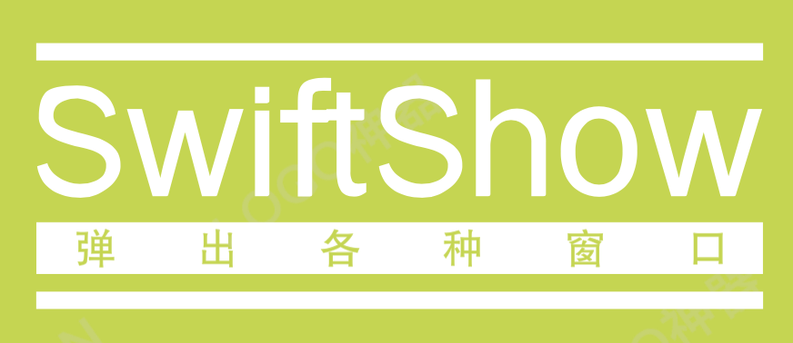

[](http://cocoapods.org/pods/SwiftShow)
[](https://swift.org/package-manager/)


[](https://developer.apple.com/swift/)

A versatile popup/HUD library for iOS providing Toast, Loading, Alert, PopView, and DropDown views.

See the Example project for detailed usage.

## Installation

### CocoaPods

1. Add `pod 'SwiftShow'` to your Podfile
2. Run `pod install` or `pod update`
3. Import with `import SwiftShow`

### Swift Package Manager

SwiftShow supports SPM. In Xcode:

`File > Swift Packages > Add Package Dependency`, then enter:

`https://github.com/zjinhu/SwiftShow`

### Manual Integration

Drag the `SwiftShow` folder from `Sources/SwiftShow` into your project.

## Usage

All popup APIs are centralized in `Show.swift`.

### 1. Toast

|                       |                       |                       |
| --------------------- | --------------------- | --------------------- |
| 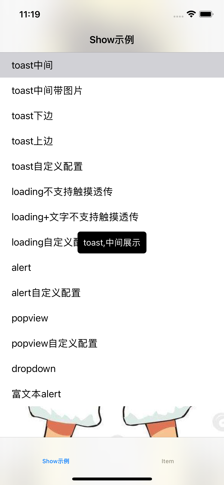 | 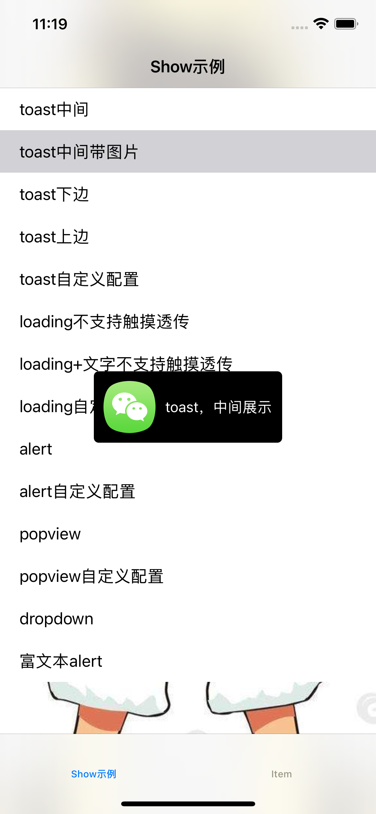 | 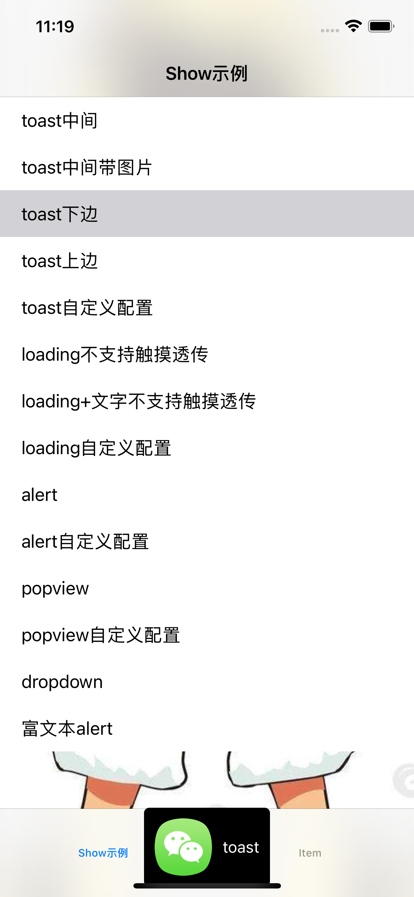 |
| 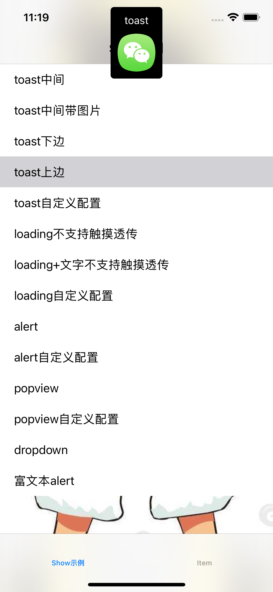 | 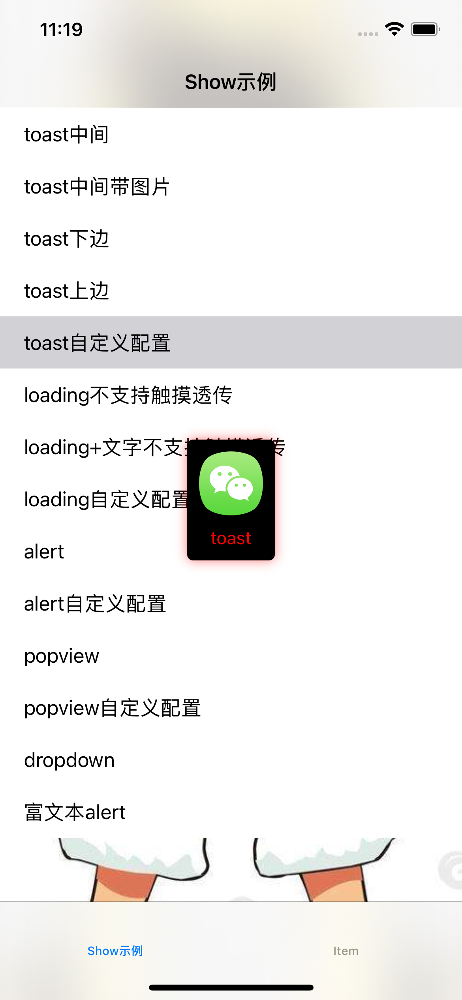 |                       |

#### Configuration

```swift
public class ShowToastConfig {
    public var animateDuration = 0.5        // Animation duration, default 0.5s
    public var showTime: Double = 3.0       // Display duration, default 3.0s
    public var maxWidth: Float = 200        // Max width, default 200
    public var maxHeight: Float = 500       // Max height, default 500
    public var cornerRadius: CGFloat = 5    // Corner radius, default 5
    public var bgColor: UIColor             // Background color, default black
    public var shadowColor: CGColor         // Shadow color, default clear
    public var shadowOpacity: Float = 0.5   // Shadow opacity, default 0.5
    public var shadowRadius: CGFloat = 5    // Shadow radius, default 5
    public var imageType: ImageLayoutType   // Image layout, default .left
    public var padding: Float = 10          // Inner padding, default 10
    public var offSet: Float = 100          // Offset from center, default 100
    public var offSetType: ToastOffset      // Position type, default .center
    public var titleColor: UIColor          // Title color, default white
    public var titleFont: UIFont            // Title font, default system 15
    public var subTitleColor: UIColor       // Subtitle color, default light gray
    public var subTitleFont: UIFont         // Subtitle font, default system 12
    public var spaceImage: CGFloat = 5      // Image-text spacing, default 5
    public var spaceText: CGFloat = 5       // Text line spacing, default 5
}
```

#### API

```swift
/// Show toast notification
/// - Parameters:
///   - title: Title text
///   - subTitle: Subtitle text (optional)
///   - image: Image (optional)
///   - config: Toast configuration closure (optional, uses defaults)
Show.toast("Success", subTitle: "Operation completed", image: UIImage(named: "check")) { config in
    config.showTime = 2.0
    config.offSetType = .top
    config.offSet = 80
}
```

### 2. Loading

| 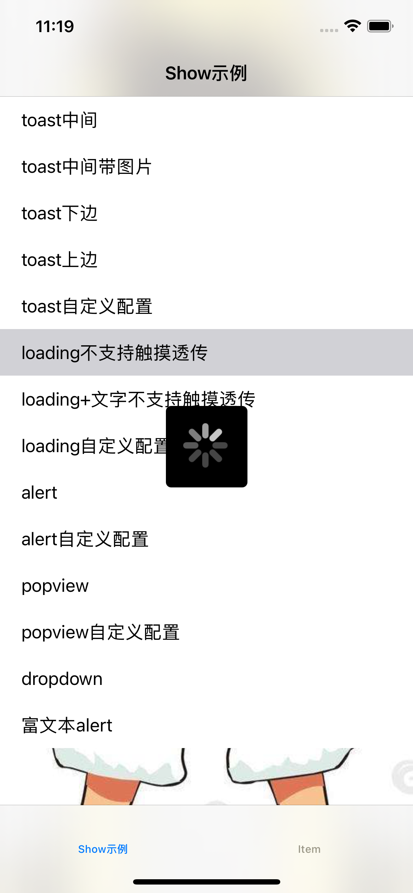 | 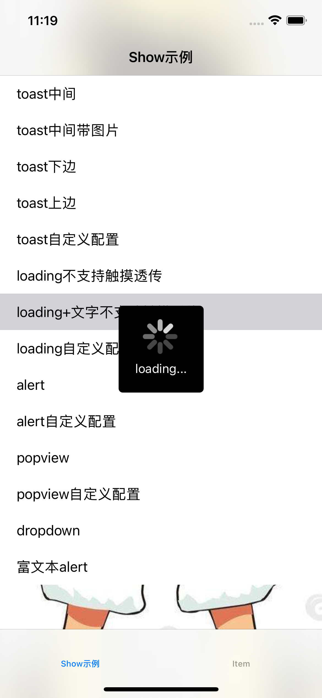 | 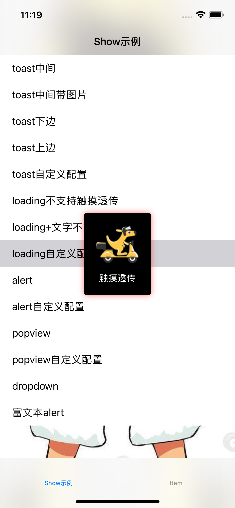 |
| ----------------------- | ----------------------- | ----------------------- |
| Default style           | With image/text         | With shadow/overlay     |

#### Configuration

```swift
public class ShowLoadingConfig {
    public var maxWidth: Float = 200          // Max width, default 200
    public var maxHeight: Float = 200         // Max height, default 200
    public var cornerRadius: CGFloat = 5      // Corner radius, default 5
    public var titleFont: UIFont              // Title font, default system 15
    public var titleColor: UIColor            // Title color, default white
    public var subTitleFont: UIFont           // Subtitle font, default system 12
    public var subTitleColor: UIColor         // Subtitle color, default light gray
    public var enableEvent: Bool = false      // Allow touch through background
    public var effectStyle: UIBlurEffectStyle // Blur effect style
    public var tintColor: UIColor             // Container color, default black
    public var bgColor: UIColor               // Background color, default clear
    public var maskType: MaskType             // Mask type, default .color
    public var imagesArray: [UIImage]?        // Image animation frames
    public var activityColor: UIColor         // Spinner color, default white
    public var animationTime: Double = 1.0    // Animation duration, default 1.0s
    public var imageType: ImageLayoutType     // Layout style, default .top
    public var verticalPadding: Float = 20    // Vertical padding, default 20
    public var horizontalPadding: Float = 20  // Horizontal padding, default 20
    public var spaceImage: CGFloat = 5        // Image-text spacing, default 5
    public var spaceText: CGFloat = 5         // Text spacing, default 5
}
```

#### API

```swift
/// Show loading in current view controller
Show.loading("Loading", subTitle: "Please wait...")

/// Show loading on window
Show.loadingOnWindow("Loading...")

/// Show loading on specific view
Show.loadingOnView(myView, title: "Loading...")

/// Hide loading (current VC)
Show.hideLoading()

/// Hide loading (window)
Show.hideLoadingOnWindow()

/// Hide loading (specific view)
Show.hideLoadingOnView(myView)
```

### 3. Alert

| 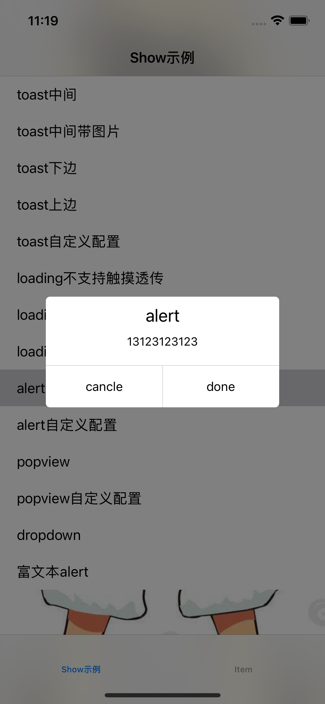 | 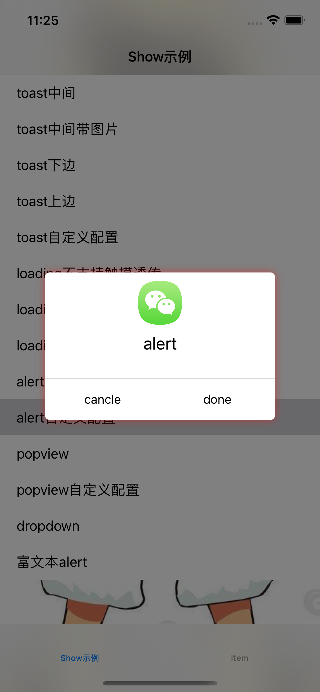 | 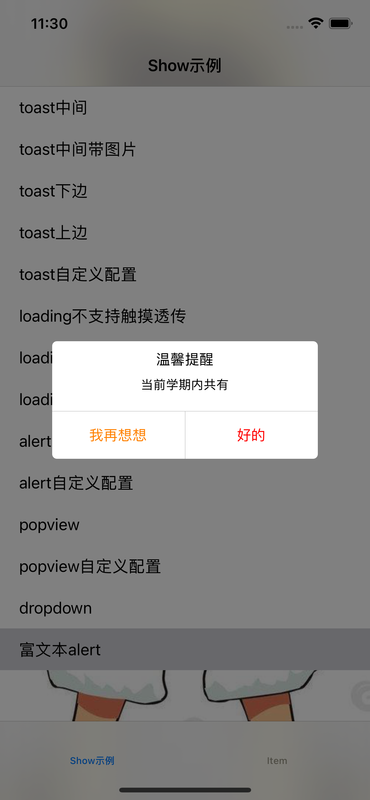 |
| --------------------- | --------------------- | --------------------- |
| Default dialog        | Custom shadow/overlay | Attributed text       |

#### Configuration

```swift
public class ShowAlertConfig {
    public var animateDuration = 0.5       // Animation duration, default 0.5s
    public var effectStyle                 // Blur effect style
    public var width: Float = 280          // Alert width, default 280
    public var maxHeight: Float = 500      // Max height, default 500
    public var buttonHeight: Float = 50    // Button height, default 50
    public var cornerRadius: CGFloat = 5   // Corner radius, default 5
    public var space: Float = 5            // Image-text spacing, default 5
    public var tintColor: UIColor          // Container color, default white
    public var bgColor: UIColor            // Background color, default black 50% alpha
    public var lineColor: UIColor          // Divider color, default light gray
    public var maskType: MaskType          // Mask type, default .color
    public var titleFont: UIFont           // Title font, default system 21
    public var titleColor: UIColor         // Title color, default text color
    public var textFont: UIFont            // Message font, default system 14
    public var textColor: UIColor          // Message color, default text color
    public var buttonFont: UIFont          // Button font, default system 15
    public var leftColor: UIColor          // Left button color, default text color
    public var rightColor: UIColor         // Right button color, default text color
    public var verticalPadding: Float = 10 // Vertical padding, default 10
    public var horizontalPadding: Float = 10 // Horizontal padding, default 10
}
```

#### API

```swift
/// Default style Alert
Show.alert(title: "Confirm",
           message: "Are you sure?",
           leftBtnTitle: "Cancel",
           rightBtnTitle: "OK",
           leftBlock: { print("Cancelled") },
           rightBlock: { print("Confirmed") })

/// Attributed text Alert
Show.attributedAlert(attributedTitle: attributedTitle,
                     attributedMessage: attributedMessage,
                     leftBtnAttributedTitle: leftAttributed,
                     rightBtnAttributedTitle: rightAttributed,
                     leftBlock: { },
                     rightBlock: { })

/// Custom Alert (with image, attributed text, and config)
Show.customAlert(title: "Title",
                 image: UIImage(named: "icon"),
                 message: "Message",
                 leftBtnTitle: "Cancel",
                 rightBtnTitle: "OK",
                 leftBlock: { },
                 rightBlock: { }) { config in
    config.tintColor = .systemBlue
    config.cornerRadius = 12
}

/// Hide Alert
Show.hideAlert()
```

### 4. PopView

| 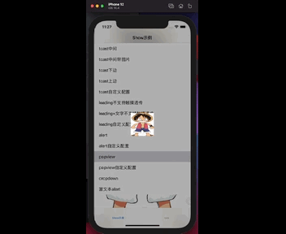 | 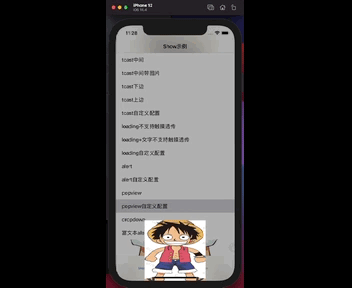 |
| ------------------- | ------------------- |

#### Configuration

```swift
public class ShowPopViewConfig {
    public var effectStyle                // Blur effect style
    public var clickOutHidden = true      // Dismiss on tap outside, default true
    public var maskType: MaskType         // Mask type, default .color
    public var bgColor: UIColor           // Background color, default black 30% alpha
    public var animateDuration = 0.3      // Animation duration, default 0.3s
    public var animateDamping = true      // Enable spring animation, default true
    public var isAnimate = true           // Enable animation, default true
    public var showAnimateType: PopViewShowType? = .center // Show direction
}
```

#### API

```swift
/// Show pop-up view
Show.pop(myContentView) { config in
    config.showAnimateType = .bottom
    config.animateDamping = true
} showClosure: {
    print("Pop shown")
} hideClosure: {
    print("Pop hidden")
}

/// Hide pop-up view
Show.hidePop {
    print("Pop dismissed")
}
```

### 5. DropDown

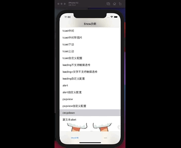

#### Configuration

```swift
public class ShowDropDownConfig {
    public var effectStyle                // Blur effect style
    public var clickOutHidden = true      // Dismiss on tap outside, default true
    public var maskType: MaskType         // Mask type, default .color
    public var bgColor: UIColor           // Background color, default black 30% alpha
    public var animateDuration = 0.3      // Animation duration, default 0.3s
    public var animateDamping = true      // Enable spring animation, default true
    public var isAnimate = true           // Enable animation, default true
    public var fromY: CGFloat = 88        // Starting Y position, default 88
}
```

#### API

```swift
/// Show drop-down view (can cover TabBar)
Show.coverTabbar(myContentView) { config in
    config.fromY = 100
} showClosure: {
    print("DropDown shown")
} hideClosure: {
    print("DropDown hidden")
} willShowClosure: {
    print("Will show")
} willHideClosure: {
    print("Will hide")
}

/// Check if DropDown is currently showing
let isVisible = Show.isHaveCoverTabbarView()

/// Hide DropDown
Show.hideCoverTabbar {
    print("DropDown dismissed")
}
```

### 6. Utility

```swift
/// Get the top-most view controller
let topVC = Show.currentViewController()
```

---

## AI Skills Usage Guide

SwiftShow provides an AI Skills file that enables AI coding assistants to quickly understand and use this library.

### What is the Skills File?

The `.ai/skills/swiftshow.md` file contains comprehensive API reference, configuration options, and usage patterns designed specifically for AI assistants.

### How AI Uses the Skills File

When working on an iOS project that uses SwiftShow, AI assistants will:

1. **Auto-detect** the Skills file in the `.ai/skills/` directory
2. **Reference** the API signatures and configuration options
3. **Generate** correct SwiftShow code with proper syntax

### Example AI Prompts

When using AI coding assistants, you can use prompts like:

```
Add a loading indicator while fetching data
```

The AI will read the Skills file and generate:

```swift
Show.loading("Loading", subTitle: "Fetching data...")
// ... your async code ...
Show.hideLoading()
```

```
Show a success toast after saving
```

The AI will generate:

```swift
Show.toast("Success", subTitle: "Data saved", image: UIImage(systemName: "checkmark.circle.fill"))
```

```
Show a confirmation alert before deleting
```

The AI will generate:

```swift
Show.alert(title: "Delete",
           message: "Are you sure you want to delete this item?",
           leftBtnTitle: "Cancel",
           rightBtnTitle: "Delete",
           rightBlock: { 
               // Delete action
           })
```

### Skills File Location

```
.ai/skills/swiftshow.md
```

This file is automatically discovered by AI coding assistants and provides:
- Complete API reference with method signatures
- All configuration properties with defaults
- Common usage patterns and examples
- Best practices for each component type
